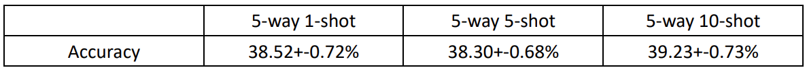

# Deep Learning for Computer Vision HW4
## HW4 Project 1 ― Prototypical Network
- In this project, I will implement the prototypical network to perform 5-way 1-shot classification. Prototypical Networks learn a metric space in which classification can be performed by computing distances to prototype representations of each class.

- Perform 5-way 5-shot and 5-way 10-shot classification.

- Model:

Reference: [Prototypical Networks for Few-shot Learning](https://arxiv.org/pdf/1703.05175.pdf)

## HW4 Project 2 ― Data Hallucination for Few-shot Learning
- In this project, I will improve the prototypical network by data hallucination. Hallucinator will
take a seed example x and a noise vector z as input, and produce a hallucinated example as output.

- perform 5-way 1-shot M-augmentation classification and analyze the quality of the hallucinated data by t-SNE. (M=10, 50, 100)

- Model:

Reference: [Low-Shot Learning from Imaginary Data](https://arxiv.org/pdf/1801.05401.pdf)

## HW4 Project 3 ― Improved Data Hallucination Model
- Implement an improved data hallucination model to perform few-shot classification.
- Related Few-Shot Learning papers:

    [Adversarial Feature Hallucination Networks for Few-Shot Learning. CVPR 2020](https://arxiv.org/pdf/2003.13193.pdf)
    
    [Diversity Transfer Network for Few-Shot Learning. AAAI 2020](https://arxiv.org/pdf/1912.13182.pdf)
    
    [Image Deformation Meta-Networks for One-Shot Learning. CVPR 2019](https://arxiv.org/pdf/1905.11641.pdf)
    
    [Multi-level Semantic Feature Augmentation for One-shot Learning. TIP 2019](https://arxiv.org/pdf/1804.05298.pdf)

## Dataset
- Contact me for Dataset.
- Email: chengliang.yeh@gmail.com

## Evaluation
Run the evaluation script by using the following command.

    python3 eval.py $1 $2

 - `$1` is the path to your predicted results (e.g. `output/val_pred.csv`)
 - `$2` is the path to the ground truth (e.g. `hw4_data/val_testcase_gt.csv	`)

Note that for `eval.py` to work, your predicted `.csv` files should have the same format as the ground truth files `val_testcase_gt.csv` provided in the dataset.

## Result
- Prototypical Network result (meta-train and meta-test under the same 5-way K-shot setting, (K=1, 5, 10))

    

- Data Hallucination result with t-SNE visualization.
    Fail to seperate real datas and hallucinated datas.
    
   
- Check more detail in hw4_report.pdf

### Submission Format
Aside from your own Python scripts and model files, you should make sure that your submission includes *at least* the following files in the **root directory** of this repository:
 1.   `hw4_<StudentID>.pdf`  
The report of your homework assignment. Refer to the "*Grading*" section in the slides for what you should include in the report. Note that you should replace `<StudentID>` with your student ID, **NOT** your GitHub username.
 2.   `hw4_download.sh` 
 Download all the models needed for Problem 1~3. We will execute this script first.
 3.   `hw4_1.sh`  
The shell script file for running your Prototypical Network.
This script takes as input a folder containing testing images, and should output the predicted results in a `.csv` file.
 4.   `hw4_2.sh`  
The shell script file for running your network with data hallicination.
This script takes as input a folder containing testing images, and should output the predicted results in a `.csv` file.
 5.   `hw4_3.sh`  
The shell script file for running your network with improved data hallicination.. 
This script takes as input a folder containing testing images, and should output the predicted results in a `.csv` file.

TA will run your code in the following manner:

    bash hw4_download.sh
    bash hw4_1.sh $1 $2 $3 $4
    bash hw4_2.sh $1 $2 $3 $4
    bash hw4_3.sh $1 $2 $3 $4 $5 $6

-   `$1` testing images csv file (e.g., `hw4_data/val.csv`)
-   `$2` testing images directory (e.g., `hw4_data/val`)
-   `$3` path of test case on test set (e.g., `hw4_data/val_testcase.csv`)
-   `$4` path of output csv file (predicted labels) (e.g., `output/val_pred.csv`)
-   `$5`: training images csv file (e.g., `hw4_data/train.csv`)
-   `$6`: training images directory (e.g., `hw4_data/train`)

> 🆕 ***NOTE***  
> For the sake of conformity, please use the `python3` command to call your `.py` files in all your shell scripts. Do not use `python` or other aliases, otherwise your commands may fail in our autograding scripts.

### Packages
This homework should be done using python3.6. For a list of packages you are allowed to import in this assignment, please refer to the requirments.txt for more details.

You can run the following command to install all the packages listed in the requirements.txt:

    pip3 install -r requirements.txt

Note that using packages with different versions will very likely lead to compatibility issues, so make sure that you install the correct version if one is specified above. E-mail or ask the TAs first if you want to import other packages.

# Q&A
If you have any problems related to HW4, you may
- Use TA hours
- Contact TAs by e-mail ([ntudlcv@gmail.com](mailto:ntudlcv@gmail.com))
- Post your question under hw4 FAQ section in FB group
